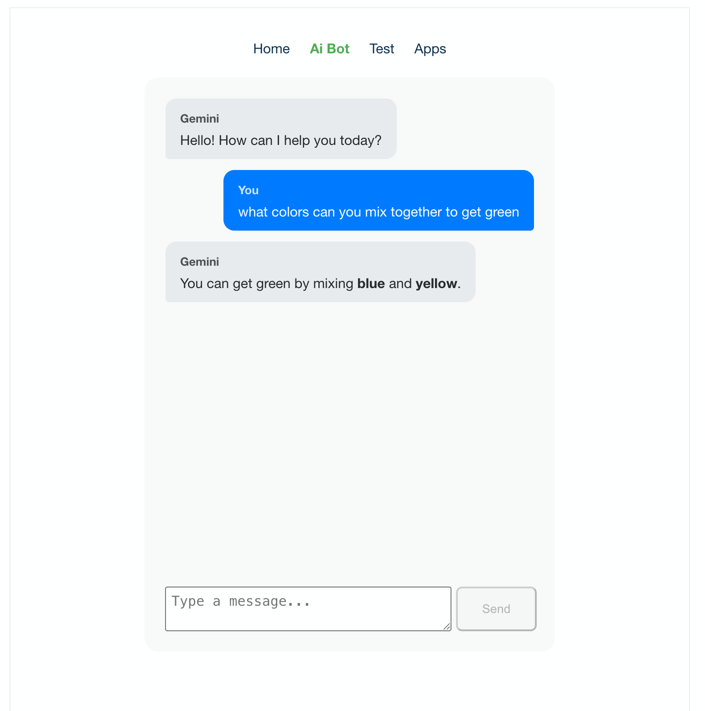

# Modern Vue App

A modern Vue 3 application showcasing various features and LLC integration like google and chatGPT. Utilize graphQL to simplify the development process.


## Features

### Todo List Management

- Add, complete, and delete todos
- Persistent storage using GraphQL backend
- Visual feedback:
  - Hover effects for delete actions
  - Strikethrough effect for completed items
  - Clean, minimal UI with icons
- Checked items are displayed at the bottom of the list
- Real-time updates using Apollo Client

### AI Assistant Integration

- Interactive chat interface
- Real-time conversation
- Loading indicators for responses
- Error handling and feedback

### Navigation

- Responsive menu system
- Dropdown support for nested navigation
- Application demo section with:
  - Calculator
  - Data Table (I'm planning on adding data grid here)

### Authentication

- Secure login system
- Password visibility toggle
- Loading states during authentication
- Session management

## Project Setup

### Local Development

```bash
# Install dependencies
npm install

# Start both Vue frontend and Lambda backend
npm run dev

# This will start:
# - Vue app on port 5173
# - Lambda functions on port 4000
```

## Project Structure

```
src/
├── api/
│   └── lambda/          # Local GraphQL server
├── components/
│   ├── AIAssistant/    # AI chat interface
│   └── ToDo/           # Todo list components
├── views/              # Page components
├── stores/            # State management
└── router/            # Navigation setup
```

## Technologies Used

- Vue 3 with Composition API
- TypeScript for type safety
- GraphQL for API interactions
- Local storage for data persistence
- CSS modules for styling

## Development Commands

```bash
# Start development servers (frontend + lambda)
npm run dev

# Build for production (need to work out the build script)
npm run build

```
